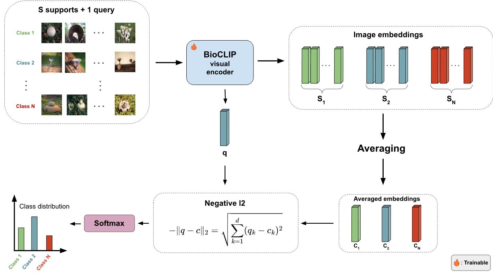

# Prototype-Network-FungiCLEF25

This is the official code repository of the paper: Improving Fungi Prototype Representations for Few-Shot
Classification published at FungiCLEF25 @ CVPR-FGVC & LifeCLEF